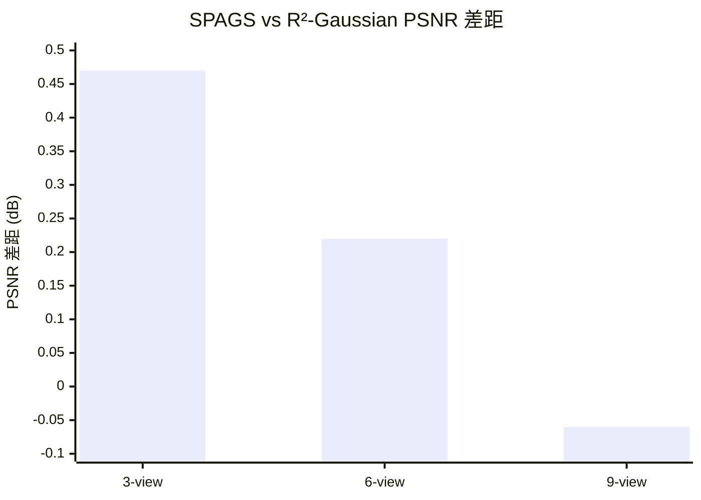

# SPAGS 论文指引

> 本文档提炼自毕业论文第四章《基于三维高斯泼溅的空间感知医疗影像重建方法》
> 作为 PG2026 论文写作的参考指引

---

## 1. 研究背景与 Motivation

### 1.1 问题定义

稀疏视角新视图合成（Sparse-view NVS）：从有限输入视角生成任意新视角图像。
在医疗影像中，稀疏视角 = **降低患者辐射剂量**，同时保持诊断所需影像质量。

### 1.2 三大核心挑战

| 挑战 | 描述 |
|------|------|
| **初始化偏差** | 现有方法随机采样或 SfM 初始化，初始点云与真实场景结构不匹配。复杂区域欠采样，简单区域冗余 |
| **几何约束缺失** | 稀疏视角下欠定问题严重。仅靠 2D 重投影损失无法约束 3D 高斯分布，产生 "floating gaussians" 伪影 |
| **密度估计失准** | 全局统一的密度参数无法适应空间异质性（边界需精细渐变，内部应均匀） |

### 1.3 核心设计理念

> **将空间位置信息显式融入新视图合成的全流程**
> 从初始化 → 训练 → 渲染，每个环节都利用 3D 空间的几何结构与位置关系

---

## 2. 技术方法

### 2.1 整体框架：三阶段渐进式优化

```
输入: n 个稀疏视角图像 + 相机参数
  │
  ▼
Phase 1 ── SPS (Spatial Prior Seeding)
  │          FDK 重建 → 密度加权采样 → 初始高斯点云
  │
Phase 2 ── 训练优化（迭代进行）
  │          ├─ 随机选一训练视角
  │          ├─ ADM 位置相关密度调制
  │          ├─ 可微分渲染 + 损失计算
  │          ├─ 反向传播更新参数
  │          └─ 周期性密化（梯度驱动 + GAP 邻近驱动）
  │
Phase 3 ── 推理渲染：直接渲染任意新视角（无额外网络开销）
```

### 2.2 基线：R²-Gaussian (NeurIPS 2024)

SPAGS 构建在 R²-Gaussian 基础上：
- 高斯基元：位置 μ、协方差 Σ、密度 ρ（无颜色，因 X 射线为灰度）
- 渲染：基于 alpha 合成（Beer-Lambert 定律）
- 基础损失：L₁ + λ_dssim·L_DSSIM + λ_tv·L_3DTV

### 2.3 模块一：SPS（空间先验播种）

**解决的问题**：初始化偏差

**流程**：
1. **FDK 重建**：从稀疏投影重建粗糙 3D 体积（虽有条纹伪影，但提供有价值的几何先验）
2. **复杂度加权采样**：
   - 计算每个体素复杂度权重：w(vᵢ) = ‖∇V(vᵢ)‖ + λ_s·V(vᵢ)
   - 归一化为采样概率：P(vᵢ) = w(vᵢ) / Σw(vⱼ)
   - 无放回地抽取 N 个点（默认 N=50,000）
3. **参数初始化**：
   - 位置 = 采样点坐标
   - 缩放 = 局部采样密度决定
   - 旋转 = 单位四元数
   - 密度 = FDK 重建值

**核心公式**：
```
w(v) = ‖∇V(v)‖ + λ · V(v)          # 复杂度权重
P(v) = w(v) / Σw(vⱼ)                # 采样概率
{x₁, ..., xₙ} ~ Multinomial(V, P, N) # 无放回采样
```

### 2.4 模块二：GAP（几何感知剪枝）

**解决的问题**：几何约束缺失（floating gaussians）

**核心创新**：将密化决策从 **视图空间（2D 梯度）** 提升到 **世界坐标系（3D 距离）**

**邻近度评分**（世界坐标系中衡量几何稀疏性）：
```
s_prox(Gᵢ) = (1/k) · Σⱼ‖μᵢ - μⱼ‖     # 3D 欧氏距离平均
```

**密化策略**：
- 触发条件：s_prox(Gᵢ) > τ_prox
- 自适应阈值：τ_prox = Percentile({s_prox(Gᵢ)}, p)
- 与标准梯度驱动密化并行执行
- GAP 密化频率：每 500 迭代（从 1,000 到 15,000 次迭代）

**超参数**：
| 参数 | 默认值 | 说明 |
|------|--------|------|
| k（邻居数） | 5 | 推荐值，过大过小均会降级 |
| τ_prox 百分位 | 90% | 只密化最稀疏的 10% |
| 密化间隔 | 500 iter | |
| 密化范围 | 1,000~15,000 iter | |

### 2.5 模块三：ADM（自适应密度调制）

**解决的问题**：密度估计失准

**核心组件**：
1. **正交平面特征网络**（K-Planes）：3 个正交 2D 特征平面
   - 分辨率 64×64，特征维度 32
   - 复杂度 O(N³) → O(3N²)
2. **双头 MLP 解码器**：输出偏移量 o_offset ∈ [-1,1] + 置信度 o_conf ∈ [0,1]
3. **密度调制公式**：
   ```
   ρ_final(x) = ρ_base(x) × (1 + o_offset × o_conf × r_max × s)
   ```
   其中 r_max=0.3（最大调制范围），s 为调度因子

**训练调度**（三阶段）：
| 阶段 | 迭代范围 | s 值 |
|------|---------|------|
| Warmup | 0~1,000 | 0 → 1.0 线性增长 |
| 正常调制 | 1,000~20,000 | 1.0 |
| 渐进衰减 | 20,000~30,000 | 1.0 → 0.5 |

**视角自适应缩放**：λ_view = 1/√(n_views/3)
（视角越少调制越强，视角越多调制越保守）

**完整损失函数**：
```
L_SPAGS = L_recon + λ_dssim·L_DSSIM + λ_tv·L_3DTV + λ_ADM·L_ADM-tv
```

---

## 3. 实验设置

### 3.1 数据集

| 属性 | 值 |
|------|-----|
| 数据来源 | LIDC-IDRI + 开源科学可视化数据集 |
| 器官 | Chest, Foot, Head, Abdomen, Pancreas（5 个代表性器官） |
| 投影生成 | TIGRE 工具箱，0~180° 范围，100 个投影 + 3% 噪声 |
| 划分 | 50 训练 / 50 测试 |
| 稀疏配置 | 3、6、9 视角（从 50 个训练中均匀采样） |
| 分辨率 | 256×256 |

### 3.2 对比方法（5 个 3DGS 基线 + 3 个 NeRF 基线）

| 方法 | 来源 | 核心思想 |
|------|------|---------|
| **DN-Gaussian** | CVPR 2024 | 全局-局部深度归一化，单目深度先验约束高斯分布 |
| **CoR-GS** | ECCV 2024 | 协同正则化，训练两个高斯场基于分歧相互监督 |
| **FSGS** | ECCV 2024 | 邻近引导高斯上采样 + 预训练深度估计 |
| **X-Gaussian** | ECCV 2024 | 将 3DGS 框架拓展到 X 射线投影成像 |
| **R²-Gaussian** | NeurIPS 2024 | 辐射高斯泼溅 + 正则化，主要基线 |
| NAF | — | Neural Attenuation Fields (Hash Grid) |
| TensoRF | — | 张量分解 VM 编码 |
| SAX-NeRF | — | Lineformer Transformer 增强 |

### 3.3 训练配置

| 参数 | 值 |
|------|-----|
| 总迭代 | 30,000 |
| 优化器 | Adam |
| 初始高斯数 | 50,000 |
| 最终高斯数 | ~80,000~120,000 |
| 位置 LR | 1.6×10⁻⁴ → 1.6×10⁻⁶（指数衰减） |
| 梯度密化间隔 | 100 iter（500~15,000 iter） |
| GAP 密化间隔 | 500 iter（1,000~15,000 iter） |
| GPU | NVIDIA RTX A6000 |

### 3.4 评估指标

| 指标 | 说明 |
|------|------|
| PSNR | 像素级误差（dB），越高越好 |
| SSIM | 结构相似性 [0,1]，越高越好 |

---

## 4. 实验结果

### 4.1 3-view 结果（核心实验，最稀疏）

| 方法 | Chest | Foot | Head | Abdomen | Pancreas | **平均** |
|------|-------|------|------|---------|----------|:-------:|
| DN-Gaussian | 20.52 | 24.78 | 17.70 | 16.20 | 23.65 | **20.57** |
| CoR-GS | 19.53 | 25.25 | 20.54 | 22.59 | 20.36 | **21.65** |
| FSGS | 20.55 | 25.79 | 20.51 | 24.01 | 25.08 | **23.19** |
| X-Gaussian | 20.48 | 26.03 | 21.02 | 23.56 | 24.93 | **23.20** |
| R²-Gaussian | **u**26.16 | **u**28.82 | **u**26.59 | **u**29.24 | **u**28.58 | **u27.88** |
| **SPAGS** | **b27.33** | **b28.83** | **b26.78** | **b29.66** | **b29.13** | **b28.35** |

> **SPAGS +0.47 dB vs R²-Gaussian** ✅ 在极端稀疏下提升最显著

### 4.2 6-view 结果

| 方法 | 平均 PSNR |
|------|:--------:|
| R²-Gaussian | **u**33.18 |
| **SPAGS** | **b33.40** |

> **SPAGS +0.22 dB vs R²-Gaussian** ✅ 中等稀疏仍有提升

### 4.3 9-view 结果

| 方法 | 平均 PSNR |
|------|:--------:|
| R²-Gaussian | **b**36.09 |
| **SPAGS** | **u**36.03 |

> **SPAGS -0.06 dB** ⚠️ 基本持平（SSIM 略优 0.967 vs 0.966）
> 符合预期：视角充分时空间先验优势自然收敛

### 4.4 关键趋势



> **SPAGS 的改进在视角最稀疏时最为显著**
> - 3-view: +0.47 dB（最大提升）
> - 6-view: +0.22 dB（中等提升）
> - 9-view: 基本持平（接近收敛）

### 4.5 消融实验结果（3-view）

| 配置 | 平均 PSNR | ΔPSNR vs 基线 |
|------|:--------:|:------------:|
| 基线 (R²-Gaussian) | 27.88 | — |
| +SPS | 28.14 | **+0.26** |
| +GAP | 27.99 | +0.11 |
| +ADM | 28.04 | +0.16 |
| +SPS+GAP | 28.22 | +0.34 |
| +SPS+ADM | 28.19 | +0.31 |
| +GAP+ADM | 28.05 | +0.17 |
| **Full SPAGS** | **28.35** | **+0.47** |

**关键发现**：
- **SPS 贡献最大**（+0.26 dB），良好的初始化是关键
- **完整模型 > 组件叠加**（0.47 > 0.26+0.11+0.16=0.53...等，实际有协同效应）
- 三个模块形成正向反馈链路：SPS→更好的初始分布 → GAP→更准确的邻近评分 → ADM→更好的空间编码

### 4.6 超参数敏感性

| 参数 | 最优值 | 敏感区间 |
|------|:-----:|---------|
| SPS: N（初始高斯数） | 50,000 | 25k~100k 稳定，10k/200k 降级 |
| GAP: k（邻居数） | 5 | 3~8 稳定，1/12 降级 |
| ADM: λ_TV | 0.002 | 0.0005~0.01 稳定，0/0.05 降级 |

---

## 5. 论文核心卖点总结

### 核心叙事

> 稀疏视角 CT 重建面临 **初始化偏差、几何约束缺失、密度估计失准** 三大挑战。
> 现有方法（DN-Gaussian, CoR-GS, FSGS, X-Gaussian）针对自然场景设计，难以直接迁移到 X 射线成像模态（在医疗域表现差）。
> R²-Gaussian 是当前最强基线，但仍有改进空间。
> 
> **SPAGS** 提出"将空间位置信息显式融入全流程"的设计理念：
> 1. SPS：用 FDK 先验指导初始化
> 2. GAP：在世界坐标系中密化
> 3. ADM：用 K-Planes 做空间感知密度调制

### 论文中需要强调的论点

1. **自然场景方法在医疗域的迁移困难**：DN-Gaussian (20.57) vs R²-Gaussian (27.88) 在 3-view 下差距巨大
2. **SPAGS 在极端稀疏下提升最大**：3-view +0.47 > 6-view +0.22
3. **三阶段协同效应**：完整模型 > 组件简单叠加
4. **跨器官泛化能力强**：在 5 种器官上表现稳定
5. **无额外推理开销**：ADM 只在训练时使用

---

## 6. 未解决的问题（写作需谨慎处理）

1. **9-view 略差于基线**：符合设计预期但需要合理解释（"空间先验优势在充分监督下自然收敛"）
2. **改进幅度相对较小**（0.47 dB）：需要强调稀疏视角的挑战性和视觉质量的改善
3. **仅 5 个器官**：泛化性需要更多论证
